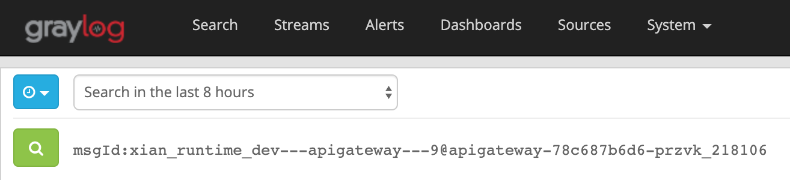
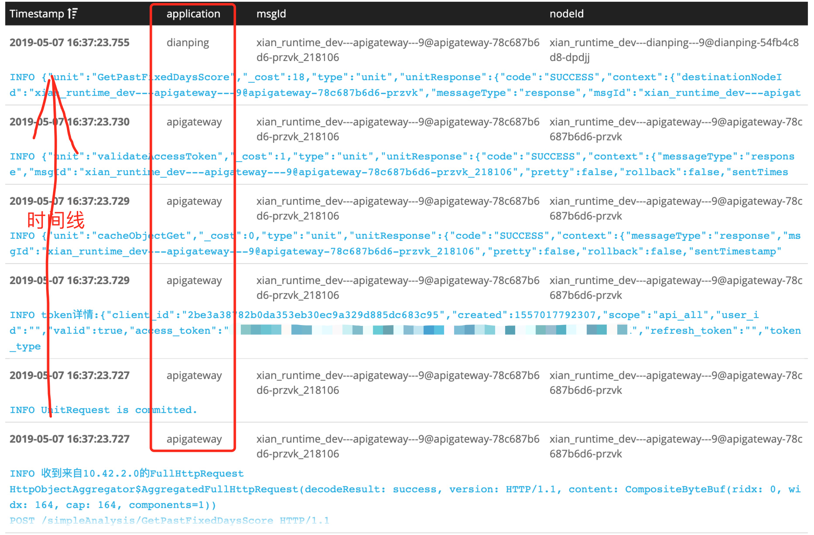

# 全链路日志
全链路日志即分布式业务日志链路追踪，该功能可以让我们在集中日志系统内通过`msgId`（类似traceId）查询和定位出指定业务链路上完备日志线条。<br/>
xian框架基于threadContext实现msgId传递机制，将业务日志做了串联记录到集中日志系统内。

## 优秀的全链路日志特性
1. 业务日志非侵入性
2. 业务日志粒度的日志链，不仅仅是zipkin那个调用链

### 业务日志非侵入性
场景：我们在编写业务代码时根据实际需要打印业务日志，而不需要人工去给日志关联traceId，而由框架底层的日志工具帮我们默默地将业务上下文中的traceId关联到该日志上，然后将该日志发送到集中日志系统内。xian的日志打印框架代码示例如下：
```java
// json对象日志打印示例，代码见RpcClientHandler.java:31
public void channelInactive(ChannelHandlerContext ctx) throws Exception {
        LOG.info(new JSONObject() {{
            put("description", "rpcClient 申请释放空闲的长连接: remoteAddress=" + ctx.channel().remoteAddress() + " nodeId=" + nodeId);
            put("toNodeId", nodeId);
            put("rpcRemoteAddress", ctx.channel().remoteAddress().toString());
            put("type", "rpcChannelInactive");
        }});
        RpcNettyClient.removeClosedChannel(nodeId);
        ctx.channel().close();
    }
    
// 异常日志示例，源码见RpcClientUnitHandler.java:29
LOG.error(String.format("ssid=%s的消息没有找到对应的notifyHandler!整个消息内容=%s,", ssid, response), new Throwable());
```
我们可以发现，上述日志的打印，都是不需要我们关心除了业务以外的其他任何参数，比如`traceId`。

### 业务级粒度的日志链
如上文说到的，我们在框架层提供traceId机制来串联业务日志，这些日志可以通过集中日志系统进行检索和查询

<br/>
搜索结果输出msgId对应的整条业务线上的日志<br/>

说明：
1. 该图上的msgId对应的都是同一个msgId。
2. nodeId为微服务的节点id，可以看到这批日志跨越了两个节点，第一个节点未`apigateway`网关节点。第二个节点为业务节点`dianping`
3. 该图上日志按照时间线从下往上排序的。
4. 该图上的日志是一次完整的API请求日志。

